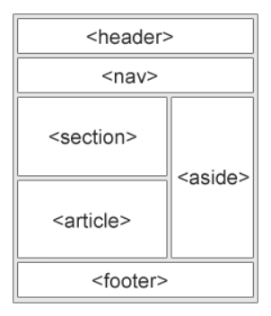

<h1 align="center">HTML Notes </h1>

### 1. What is  HTML ?

- HTML is a **Hyper Text Markup Language**.
- HTML is used to create web pages.  
- HTML was created by Sir Tim Berners-Lee. ( in 1991 ).
- HTML file name always save .html extension.

---

### 2. Which software is used for HTML ?

- Notepad. 
- Visual Studio Code.
- Sublime Text.

---

### 3. How to see output in Html ?

- Right-Click on Your HTML file, and **open with Browser**.

---

### 4. Basic structure of HTML.

```HTML
<!DOCTYPE html>
<html>
  <head>
    <title>Document Name</title>
  </head>

  <body>
    <!-- Code Write here -->
  </body>
</html>
```

---
## 5. Heading Tags.

```HTML
<!DOCTYPE html>
<html>
  <head>
    <title>Headings Tags</title>
  </head>
  <body>
    <h1> Heading 1 </h1>
    <h2> Heading 2 </h2>
    <h3> Heading 3 </h3>
    <h4> Heading 4 </h4>
    <h5> Heading 5 </h5>
    <h6> Heading 6 </h6>
  </body>
</html>
```
Output :-
---
<dl>
  <dd> 
    <h1> Heading 1 </h1>
    <h2> Heading 2 </h2>
    <h3> Heading 3 </h3>
    <h4> Heading 4 </h4>
    <h5> Heading 5 </h5>
    <h6> Heading 6 </h6> 
  </dd>
</dl>

---
## 6. Paragraph Tag.
```HTML
<!DOCTYPE html>
<html>
  <head>
    <title>Paragraph Tag</title>
  </head>
  <body>
    <p>
      Lorem ipsum dolor sit amet, consectetur adipisicing elit. Nulla,
      necessitatibus autem praesentium repudiandae commodi, adipisci cum minus
      voluptatem fugiat aliquam ipsam, ducimus facilis fugit atque aspernatur
      aperiam? Provident, veniam ut?
    </p>
  </body>
</html>
```
Output :-
---
<dl>
  <dd> 
    <p>
      Lorem ipsum dolor sit amet, consectetur adipisicing elit. Nulla,
      necessitatibus autem praesentium repudiandae commodi, adipisci cum minus
      voluptatem fugiat aliquam ipsam, ducimus facilis fugit atque aspernatur
      aperiam? Provident, veniam ut?
    </p>
  </dd>
</dl> 

---
## 7. Pre Tag.
```HTML
<!DOCTYPE html>
<html>
  <head>
    <title>Pre Tag</title>
  </head>
  <body>
    <pre>
      Lorem                  ipsum dolor sit amet, consectetur adipisicing elit. Nulla,
      necessitatibus autem praesentium repudiandae commodi, adipisci cum minus
      voluptatem fugiat aliquam ipsam, ducimus facilis fugit atque aspernatur
      aperiam? Provident, veniam ut?
    </pre>
  </body>
</html>
```
Output :-
---
<dl>
  <dd> 
    <p>
      Lorem &nbsp;&nbsp;&nbsp;&nbsp;&nbsp;&nbsp;&nbsp;&nbsp;&nbsp;&nbsp;&nbsp;&nbsp;&nbsp;&nbsp;&nbsp;&nbsp;&nbsp;&nbsp;&nbsp;&nbsp;&nbsp;&nbsp;&nbsp;&nbsp;&nbsp;&nbsp;&nbsp;&nbsp;&nbsp;&nbsp;&nbsp;&nbsp;&nbsp ipsum dolor sit amet, consectetur adipisicing elit. Nulla,
      necessitatibus autem praesentium repudiandae commodi, adipisci cum minus
      voluptatem fugiat aliquam ipsam, ducimus facilis fugit atque aspernatur
      aperiam? Provident, veniam ut?
    </p>
  </dd>
</dl> 

---
## 8. Attributes & Font Tag.
```HTML
<!DOCTYPE html>
<html>
  <head>
    <title>Headings & paragraph Tag</title>
  </head>
  <body>
    <h1 align = "center"> Heading 1 </h1>
    <h2 align = "left"> Heading 2 </h2>
    <h3 align = "right"> Heading 3 </h3>
    <h4 align = "justify"> Heading 4 </h4>
    <p>
      Lorem ipsum <font size="6" color="red" face="Bradley Hand ITC">  dolor sit amet, consectetur adipisicing elit. </font> Nulla,
      necessitatibus autem praesentium repudiandae commodi, adipisci cum minus
      voluptatem fugiat aliquam ipsam, ducimus facilis fugit atque aspernatur
      aperiam? Provident, veniam ut?
    </p>
  </body>
</html>
```
Output :-
---
<dl>
  <dd> 
    <h1 align = "center"> Heading 1 </h1>
    <h2 align = "left"> Heading 2 </h2>
    <h3 align = "right"> Heading 3 </h3>
    <h4 align = "justify"> Heading 4 </h4>
    <p>
      Lorem ipsum <font size="6" color="red" face="Bradley Hand ITC">  dolor sit amet, consectetur adipisicing elit. </font> Nulla,
      necessitatibus autem praesentium repudiandae commodi, adipisci cum minus
      voluptatem fugiat aliquam ipsam, ducimus facilis fugit atque aspernatur
      aperiam? Provident, veniam ut?
    </p>
  </dd>
</dl> 

---
## 9. Subscript & Superscript Tag.
```HTML
<!DOCTYPE html>
<html>
  <head>
    <title>Sub & Sup Tag</title>
  </head>
  <body>
    <h1>
      H <sub> 2 </sub> o
    </h1>
    <h1>
      12 <sup> th </sup>
    </h1>
  </body>
</html>
```
Output :-
---
<dl>
  <dd> 
    <h1>
      H <sub> 2 </sub> o
    </h1>
    <h1>
      12 <sup> th </sup>
    </h1>
  </dd>
</dl> 

---
## 10. Space, Break, Comment.
```HTML
&nbsp; (use for space)

<br>   (use for break a line or next line)   

<!-- Comment --> (use for comment, Comment is not show in Output)
```

---
## 11. Image Tag, HR Tag, Center Tag. 
```HTML
<!DOCTYPE html>
<html>
  <head>
    <title>Image Tag</title>
  </head>
  <body>
    <center>
        <hr>
        <!-- inside the folder img -->
        
        
        <hr>
        <!-- outside the folder img -->
        
        
        <hr>
        <!-- Online img -->
        
        <hr>
    </center>
  </body>
</html>
```
Output :-
---
<dl>
  <dd> 
    <center>
        <!-- inside the folder img -->
        
        
        <hr>
        <!-- outside the folder img -->
        
        
        <hr>
        <!-- Online img -->
        
    </center>
  </dd>
</dl> 

---
## 12. Audio Tag. 
```HTML
<!DOCTYPE html>
<html>
  <head>
    <title>Audio Tag</title>
  </head>
  <body>
        <audio controls autoplay loop muted >
          <source src="song.mp3" type="audio/mp3">
        </audio>
  </body>
</html>
```
Output :-
---
<dl>
  <dd> 
    <audio controls autoplay loop muted >
        <source src="song.mp3" type="audio/mp3">
    </audio>
  </dd>
</dl> 

---
## 13. Video Tag. 
```HTML
<!DOCTYPE html>
<html>
  <head>
    <title>Video Tag</title>
  </head>
  <body>
        <video controls loop muted height="200" width="200" poster="img1.jpg">
          <source src="Video.mp4" type="video/mp4">
        </video>
  </body>
</html>
```
Output :-
---
<dl>
  <dd> 
    <video controls loop muted height="400" width="400" poster="img1.jpg">
        <source src="Video.mp4" type="video/mp4">
    </video>
  </dd>
</dl> 

---
## 14. Marquee Tag. 
```HTML
<!DOCTYPE html>
<html>
  <head>
    <title>Marquee Tag</title>
  </head>
  <body>
        <marquee direction="left" behavior="scroll" bgcolor="red" loop="10" scrollamount="5" scrolldelay="200">
          
        </marquee>
         <!-- Behavior: scroll, slide, alternate -->
         <!-- Direction: left, right, up, down -->
  </body>
</html>
```
Output :-
---
<dl>
  <dd> 
    <marquee direction="left" behavior="scroll" bgcolor="red" loop="10" scrollamount="5" scrolldelay="200">
        
    </marquee>
  </dd>
</dl> 

---
## 15. List Tags. 
### 1 ) Unordered List
```HTML
<!DOCTYPE html>
<html>
  <head>
    <title>Unordered List</title>
  </head>
  <body>
    <!-- type = square, none, circle, disc -->
        <ul>
          <li>Coffee</li>
          <li>Tea</li>
          <li>Milk</li>
        </ul>

        <ul type="square">
          <li>Coffee</li>
          <li>Tea</li>
          <li>Milk</li>
        </ul>
  </body>
</html>
```
Output :-
---
<ul>
    <li>Coffee</li>
    <li>Tea</li>
    <li>Milk</li>
</ul>
<hr>
<ul type="square">
    <li>Coffee</li>
    <li>Tea</li>
    <li>Milk</li>
</ul>

---
### 2 ) Ordered List
```HTML
<!DOCTYPE html>
<html>
  <head>
    <title>Ordered List</title>
  </head>
  <body>
    <!-- type = A, a, I, i, 1 -->
        <ol>
          <li>Coffee</li>
          <li>Tea</li>
          <li>Milk</li>
        </ol>
        
        <ol type="A" reversed>
          <li>Coffee</li>
          <li>Tea</li>
          <li>Milk</li>
        </ol>

        <ol start="4">
          <li>Coffee</li>
          <li>Tea</li>
          <li>Milk</li>
        </ol>
  </body>
</html>
```
Output :-
---
<ol>
    <li>Coffee</li>
    <li>Tea</li>
    <li>Milk</li>
</ol>
<hr>
<ol type="A" reversed>
    <li>Coffee</li>
    <li>Tea</li>
    <li>Milk</li>
</ol>
<hr>
<ol start="4">
    <li>Coffee</li>
    <li>Tea</li>
    <li>Milk</li>
</ol>

---
### 3 ) Description List
```HTML
<!DOCTYPE html>
<html>
  <head>
    <title>Description List</title>
  </head>
  <body>
        <dl>
          <dt>Coffee</dt>
            <dd>- black hot drink</dd>
          <dt>Milk</dt>
            <dd>- white cold drink</dd>
        </dl>
  </body>
</html>
```
Output :-
---
<dl>
    <dt>Coffee</dt>
      <dd>- black hot drink</dd>
    <dt>Milk</dt>
      <dd>- white cold drink</dd>
</dl>

---
## 16. Anchor Tag. 
```HTML
<!DOCTYPE html>
<html>
  <head>
    <title>Anchor Tag</title>
  </head>
  <body>
        <a href="https://www.google.com">Visit google.com!</a><br>
        <a href="Try.html">Try File</a><br>
        <a href="https://www.w3schools.com">
          
        </a>
  </body>
</html>
```
Output :-
---
<dl>
  <dd> 
    <a href="https://www.google.com">Google</a><br>
    <a href="Try.html">Try File</a><br>
    <a href="https://www.w3schools.com">
      
    </a>
  </dd>
</dl> 

---
## 17. Table Tag. 
```HTML
<!DOCTYPE html>
<html>
  <head>
    <title>Table Tag</title>
  </head>
  <body>
    <center>
        <table border="1" cellpadding="5" cellspacing="4">
            <thead>
                <tr>
                    <th bgcolor="red" colspan="3">Holly Family College</th>
                </tr>
                <tr bgcolor="blue">
                    <th>Subject</th>
                    <th>Marks Obtained</th>
                    <th>Total Marks</th>
                </tr>
            </thead>
            <tbody>
                <tr>
                    <td bgcolor="#800080">Mathematics</td>
                    <td bgcolor="green">70</td>
                    <td bgcolor="skyblue" rowspan="3">100</td>
                </tr>
                <tr>
                    <td bgcolor="#800080">Marathi</td>
                    <td bgcolor="green">80</td>
                </tr>
                <tr>
                    <td bgcolor="#800080">English</td>
                    <td bgcolor="green">90</td>
                </tr>
            </tbody>
        </table>
    </center>
  </body>
</html>
```
Output :-
---
<dl>
  <dd>
        <table border="1" cellpadding="5" cellspacing="4">
            <thead>
                <tr>
                    <th bgcolor="red" colspan="3">Holly Family College</th>
                </tr>
                <tr bgcolor="blue">
                    <th>Subject</th>
                    <th>Marks Obtained</th>
                    <th>Total Marks</th>
                </tr>
            </thead>
            <tbody>
                <tr>
                    <td bgcolor="#800080">Mathematics</td>
                    <td bgcolor="green">70</td>
                    <td bgcolor="skyblue" rowspan="3">100</td>
                </tr>
                <tr>
                    <td bgcolor="#800080">Marathi</td>
                    <td bgcolor="green">80</td>
                </tr>
                <tr>
                    <td bgcolor="#800080">English</td>
                    <td bgcolor="green">90</td>
                </tr>
            </tbody>
        </table>
  </dd>
</dl> 

---
## 18. Form Tag. 
```HTML
<!DOCTYPE html>
<html>
  <head>
    <title>Form Tag</title>
  </head>
  <body bgcolor="#b3cccc">
    <center>
        <h1>College Addmision Form</h1>
        <form action="/submit-form" method="post">

            <label for="collegeName">College Name:</label>
            <input type="text" id="collegeName" name="collegeName" placeholder="College name here"><br><br>

            <label for="firstName">First Name:</label>
            <input type="text" id="firstName" name="firstName" placeholder="First name here"><br><br>

            <label for="lastName">Last Name:</label>
            <input type="text" id="lastName" name="lastName" placeholder="Last name here"><br><br>

            <label for="middleName">Middle Name:</label>
            <input type="text" id="middleName" name="middleName" placeholder="Middle name here"><br><br>

            <label for="phoneNumber">Phone Number:</label>
            <input type="number" id="number" name="number" placeholder="Mobile number here"><br><br>

            <label for="emailAddress">E-mail Address:</label>
            <input type="email" id="emailAddress" name="emailAddress" placeholder="emailAddress here"><br><br>

            <label for="address">Address:</label>
            <textarea rows="3" cols="22" id="address" name="address" placeholder="Home Address here"></textarea><br>

            <label>Gender:</label>
            <input type="radio" id="male" name="gender" value="male">
            <label for="male">Male</label>
            <input type="radio" id="female" name="gender" value="female">
            <label for="female">Female</label>
            <input type="radio" id="other" name="gender" value="other">
            <label for="other">Other</label><br><br>

            <label for="hobby">Hobby:</label>
            <input type="checkbox" id="chess" name="chess">Chess
            <input type="checkbox" id="carrom" name="carrom">Carrom
            <input type="checkbox" id="reading" name="reading">Reading<br><br>

            <label for="birthDate">Birth Date:</label>
            <input type="date" id="birthDate" name="birthDate"><br><br>

            <label for="country_name">Country:</label>
            <select name="" id="">
                <option value="select">-- Select Your Country --</option>
                <option value="India">India</option>
                <option value="Pakistan">Pakistan</option>
                <option value="America">America</option>
                <option value="China">China</option>
                <option value="Indonesia">Indonesia</option>
            </select><br><br>

            <label for="file">SSC Marks:</label>
            <progress id="file" value="85" max="100"> 85% </progress><br><br>

            <label for="file">Upload Your Result:</label>
            <input type="file" id="myFile" name="filename"><br><br>

            <input type="submit" value="Submit">
            <input type="reset"value="reset">
        </form>
    </center>
</body>
</html>
```
Output :-
---
<dl>
  <dd> 
    <body bgcolor="#b3cccc">
        <h1>College Addmision Form</h1>
        <form action="/submit-form" method="post">
            <label for="collegeName">&nbsp;&nbsp;College Name:</label>
            <input type="text" id="collegeName" name="collegeName" placeholder="College name here"><br><br>
            <label for="firstName">&nbsp;&nbsp;&nbsp;&nbsp;&nbsp;&nbsp; First Name:</label>
            <input type="text" id="firstName" name="firstName" placeholder="First name here"><br><br>
            <label for="lastName">&nbsp;&nbsp;&nbsp;&nbsp;&nbsp;&nbsp;&nbsp; Last Name:</label>
            <input type="text" id="lastName" name="lastName" placeholder="Last name here"><br><br>
            <label for="middleName">&nbsp;&nbsp;&nbsp;Middle Name:</label>
            <input type="text" id="middleName" name="middleName" placeholder="Middle name here"><br><br>
            <label for="phoneNumber">&nbsp;Phone Number:</label>
            <input type="number" id="number" name="number" placeholder="Mobile number here"><br><br>
            <label for="emailAddress">E-mail Address:</label>
            <input type="email" id="emailAddress" name="emailAddress" placeholder="emailAddress here"><br><br>
            <label for="address">&nbsp;&nbsp;&nbsp;&nbsp;&nbsp;&nbsp;&nbsp;&nbsp;&nbsp;&nbsp;Address:</label>
            <textarea rows="3" cols="22" id="address" name="address" placeholder="Home Address here"></textarea><br><br>
            <label>&nbsp;&nbsp;&nbsp;&nbsp;&nbsp;&nbsp;&nbsp;&nbsp;Gender:</label>
            <input type="radio" id="male" name="gender" value="male">
            <label for="male">Male</label>
            <input type="radio" id="female" name="gender" value="female">
            <label for="female">Female</label>
            <input type="radio" id="other" name="gender" value="other">
            <label for="other">Other</label><br><br>
            <label for="hobby">&nbsp;&nbsp;&nbsp;&nbsp;&nbsp;&nbsp;&nbsp;&nbsp;&nbsp;Hobby:</label>
            <input type="checkbox" id="chess" name="chess">Chess
            <input type="checkbox" id="carrom" name="carrom">Carrom
            <input type="checkbox" id="reading" name="reading">Reading<br><br>
            <label for="birthDate">&nbsp;&nbsp;&nbsp;Birth Date:</label>
            <input type="date" id="birthDate" name="birthDate"><br><br>
            <label for="country_name">&nbsp;&nbsp;&nbsp;&nbsp;&nbsp;&nbsp;Country:</label>
            <select name="" id="">
                <option value="select">-- Select Your Country --</option>
                <option value="India">India</option>
                <option value="Pakistan">Pakistan</option>
                <option value="America">America</option>
                <option value="China">China</option>
                <option value="Indonesia">Indonesia</option>
            </select><br><br>
            <label for="file">SSC Marks:</label>
            <progress id="file" value="85" max="100"> 85% </progress><br><br>
            <label for="file">Upload Your Result:</label>
            <input type="file" id="myFile" name="filename"><br><br>
            &nbsp;&nbsp;&nbsp;&nbsp;&nbsp;&nbsp;&nbsp;&nbsp;&nbsp;&nbsp;&nbsp;&nbsp;&nbsp;&nbsp;&nbsp;&nbsp;<input
                type="submit" value="Submit">
            &nbsp;&nbsp;&nbsp;&nbsp;&nbsp;&nbsp;&nbsp;&nbsp;&nbsp;&nbsp;&nbsp;&nbsp;&nbsp;&nbsp;<input type="reset"
                value="reset">
        </form>
</body>
  </dd>
</dl> 

---
## 19. Block and Inline Elements.
### 1 ) Inline Elements
- An inline element does not start on a new line.
- An inline element only takes up as much width as necessary.
```HTML
<!DOCTYPE html>
<html>
  <head>
    <title>Inline Elements</title>
  </head>
  <body>
        <!-- Start -->
        <a>
        <abbr>
        <acronym>
        <b>
        <bdo>
        <big>
        <br>
        <button>
        <cite>
        <code>
        <dfn>
        <em>
        <i>
        
        <input>
        <kbd>
        <label>
        <map>
        <object>
        <output>
        <q>
        <samp>
        <script>
        <select>
        <small>
        <span>
        <strong>
        <sub>
        <sup>
        <textarea>
        <time>
        <tt>
        <var>
        <!-- End -->
  </body>
</html>
```
 
 ---
 ### 2 ) Block Elements
- A block-level element always starts on a new line, and the browsers automatically add some space (a margin) before and after the element.
- A block-level element always takes up the full width available (stretches out to the left and right as far as it can).
```HTML
<!DOCTYPE html>
<html>
  <head>
    <title>Block Elements</title>
  </head>
  <body>
        <!-- Start -->
        <address>
        <article>
        <aside>
        <blockquote>
        <canvas>
        <dd>
        <div>
        <dl>
        <dt>
        <fieldset>
        <figcaption>
        <figure>
        <footer>
        <form>
        <h1>-<h6>
        <header>
        <hr>
        <li>
        <main>
        <nav>
        <noscript>
        <ol>
        <p>
        <pre>
        <section>
        <table>
        <tfoot>
        <ul>
        <video>
        <!-- End -->
  </body>
</html>
```

---
## 20. Semantic Elements.
```HTML
<!DOCTYPE html>
<html>
  <head>
    <title>Semantic Elements</title>
  </head>
  <body>
        <!-- Start -->
        <article>
        <aside>
        <details>
        <figcaption>
        <figure>
        <footer>
        <header>
        <main>
        <mark>
        <nav>
        <section>
        <summary>
        <time>
        <!-- End -->
  </body>
</html>
```
 Output :-
---
<dl>
  <dd> 
      
  </dd>
</dl> 

---
## 21. Some important tags.
```HTML
<!DOCTYPE html>
<html>
  <head>
    <title>Semantic Elements</title>
  </head>
  <body>
      <i>This is a italic</i>
      <button> This is a button </button>
      <span> This is a span </span>
      <q> This is a quote </q>
      <u> This is underlined </u>
      <b> This is bold </b>
      <del> This is strikethrough </del>
      <strong> This is strong </strong>
      <small> This is small </small>
      <mark> This is marked </mark>
      <ins> This is inserted </ins>
      <em> This is emphasized </em> 
  </body>
</html>
```
Output :-
---
<dl>
  <dd> 
      <i>This is a italic</i><br>
      <button> This is a button </button><br>
      <span> This is a span </span><br>
      <q> This is a quote </q><br>
      <u> This is underlined </u><br>
      <b> This is bold </b><br>
      <del> This is strikethrough </del><br>
      <strong> This is strong </strong><br>
      <small> This is small </small><br>
      <mark> This is marked </mark><br>
      <ins> This is inserted </ins><br>
      <em> This is emphasized </em><br>
  </dd>
</dl> 
